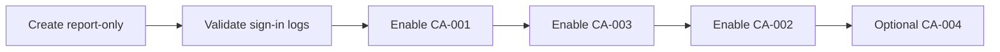

# Conditional Access and MFA

Authentication controls for Northwind Collaborative, specified in [ca-policies.spec.json](../../automation/config/ca-policies.spec.json). Operator steps: [CA rollout runbook](../setup/ca-rollout-runbook.md).

## Design Principles

1. **Report-only first** — validate impact before enforcement.
2. **Break-glass exclusion** — `SG-EXCLUDE-BreakGlass` on every policy.
3. **Admin stricter than users** — shorter session lifetime for directory roles.
4. **Block legacy auth** — close the most common CA bypass path.

## Policy Catalog

| Policy | State (initial) | Scope | Grant Control |
|--------|-----------------|-------|---------------|
| CA-001-Block-Legacy-Auth | Report-only | All users | Block legacy clients |
| CA-002-Require-MFA-All-Users | Report-only | All users | Require MFA |
| CA-003-Require-MFA-Admins | Report-only | All admin roles | Require MFA + 4h session |
| CA-004-Block-Unknown-Locations-Admins | Report-only | Admin roles | Block untrusted locations |

## Rollout Sequence

1. Create all policies in **Report-only** mode.
2. Review **Entra ID > Monitoring > Sign-in logs** for 48 hours.
3. Enable **CA-001** (legacy auth block).
4. Enable **CA-003** (admin MFA + session).
5. Confirm MFA registered for all users, then enable **CA-002**.
6. Optionally configure trusted named locations and enable **CA-004**.

## MFA Registration

Before enabling CA-002:

1. **Entra ID > Protection > Authentication methods**
2. Enable Microsoft Authenticator (push + number matching recommended).
3. Pilot with `SG-EXCLUDE-CA-ReportOnly` test users if needed.
4. Communicate registration deadline (document in access review folder).

## Break-Glass Exception Process

| Step | Action |
|------|--------|
| 1 | Document incident ticket |
| 2 | Sign in with `adm-breakglass` (excluded from CA) |
| 3 | Perform emergency change |
| 4 | Sign out; document actions in lab journal |
| 5 | Review break-glass usage quarterly |

## Portal Configuration Reference

For each policy in the Entra admin center:

- **Assignments > Users**: All users
- **Assignments > Exclude**: `SG-EXCLUDE-BreakGlass`
- **Cloud apps**: All cloud apps (or Office 365 where noted)
- **Conditions**: Per spec JSON
- **Grant**: Per spec JSON
- **Enable policy**: Report-only initially

## Screenshots

Capture redacted screenshots after configuration:

- Conditional Access policies list
- CA-002 grant controls blade
- MFA registration methods page
- Sign-in log showing CA policy applied

See [screenshot guide](../screenshots/README.md).
