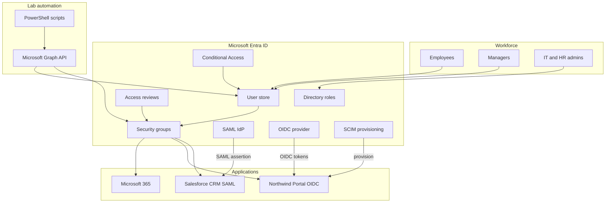
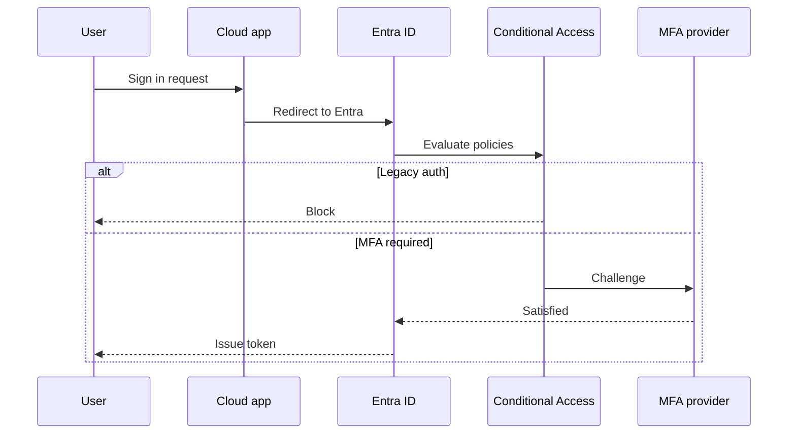
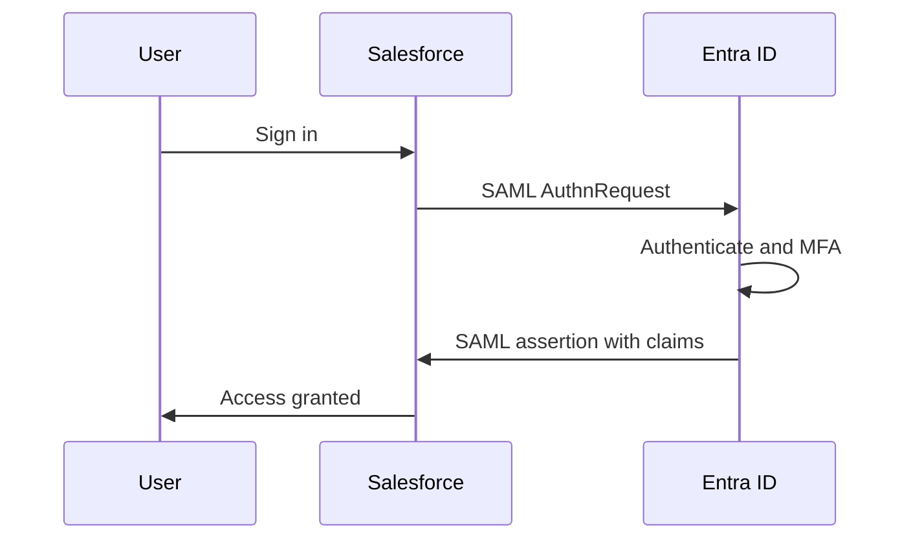
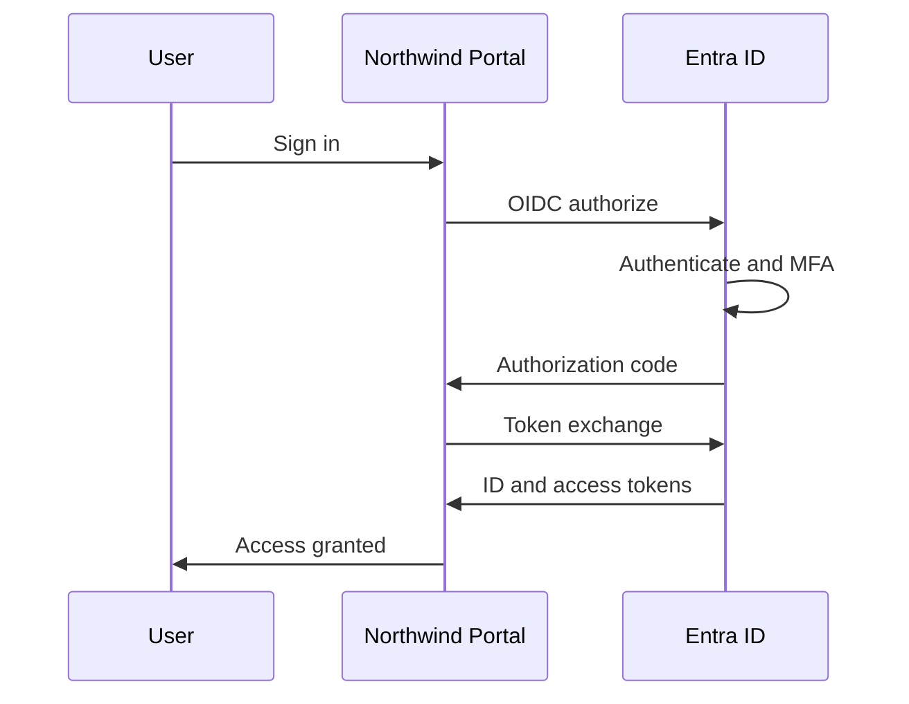

# Architecture Overview

**Northwind Collaborative** is a Microsoft Entra ID organization demonstrating enterprise IAM patterns at mid-market scale (50 synthetic users), including SAML federation, OIDC/OAuth integration, and SCIM provisioning.

## System Context

## Identity Model

| Layer | Mechanism | Examples |
|-------|-----------|----------|
| Department | Attribute + group | `department=Engineering`, `SG-DEPT-Engineering` |
| Role tier | Group | `SG-ROLE-Manager`, `SG-ROLE-IT-Administrator` |
| Application access | Group → app assignment | `SG-APP-Salesforce`, `SG-APP-NorthwindPortal` |
| Licensing | Group-based licensing | `SG-LIC-M365-E3` |
| Privileged access | Entra directory roles | Break-glass GA, IT = Privileged Role Admin |
| SAML federation | Entra IdP → Salesforce SP | Group claims in SAML assertion |
| OIDC federation | Entra IdP → Portal RP | App roles in token claims |
| SCIM provisioning | Entra → Portal | Automated create/disable on JML |

## Group Naming

| Pattern | Purpose |
|---------|---------|
| `SG-DEPT-*` | Department membership |
| `SG-ROLE-*` | Role-based access tiers |
| `SG-APP-*` | Application access |
| `SG-LIC-*` | License assignment |
| `SG-EXCLUDE-*` | CA policy exclusions |

## Authentication Flows

### Entra-Native (M365)

### SAML SSO (Salesforce CRM)

See [SAML Login Flow](../federation/saml/login-flow.md) for full detail.

### OIDC (Northwind Portal)

See [OIDC Token Flow](../federation/oidc/token-flow.md) for full detail.

## Admin Model

- **Break-glass** (`adm-breakglass`): Standing Global Administrator for emergencies only; member of `SG-EXCLUDE-BreakGlass`.
- **IT Administrators**: `SG-ROLE-IT-Administrator` → Privileged Role Administrator (not Global Admin).
- **HR Administrators**: `SG-ROLE-HR-Administrator` → User Administrator.
- **Automation**: App registration `Northwind-Lab-Automation` with certificate auth and application permissions.

## Data Sources

| Artifact | Location |
|----------|----------|
| User seed data | [users.seed.json](../../automation/config/users.seed.json) |
| Group definitions | [groups.definition.json](../../automation/config/groups.definition.json) |
| App assignments | [apps.definition.json](../../automation/config/apps.definition.json) |
| SAML spec | [saml-salesforce.spec.json](../../automation/config/saml-salesforce.spec.json) |
| OIDC spec | [oidc-portal.spec.json](../../automation/config/oidc-portal.spec.json) |
| SCIM mapping | [scim-portal.mapping.json](../../automation/config/scim-portal.mapping.json) |
| CA policy specs | [ca-policies.spec.json](../../automation/config/ca-policies.spec.json) |

## Related Documents

- [RBAC Matrix](../rbac/rbac-matrix.md)
- [Entitlement Matrix](../access-governance/entitlement-matrix.md)
- [SAML Federation](../federation/saml/architecture.md)
- [OIDC Integration](../federation/oidc/architecture.md)
- [SCIM Provisioning](../federation/scim/architecture.md)
- [Conditional Access](./conditional-access.md)
- [JML Runbook](../jml/joiner-mover-leaver.md)
- [Access Governance](../access-governance/quarterly-review.md)
- [Application Onboarding](../application-onboarding/runbook.md)
