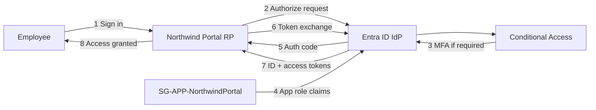

# OIDC Architecture — Northwind Employee Portal

OpenID Connect authentication from **Microsoft Entra ID** to the **Northwind Employee Portal** using the authorization code flow.

## System Context

## Components

| Component | Role |
|-----------|------|
| Microsoft Entra ID | OpenID Provider — authenticates users, issues tokens |
| Northwind Employee Portal | Relying Party — validates tokens, enforces app roles |
| `SG-APP-NorthwindPortal` | Group for `Portal.User` role assignment |
| `SG-ROLE-IT-Administrator` | Group for `Portal.Admin` role assignment |

## Configuration Spec

Lab configuration: [oidc-portal.spec.json](../../../automation/config/oidc-portal.spec.json)

Apply to tenant: `Configure-LabOidcApps.ps1` (after `Configure-LabApps.ps1`)

See also [token flow](./token-flow.md), [claims](./claims.md), and [OAuth authorization](../oauth/authorization.md).
