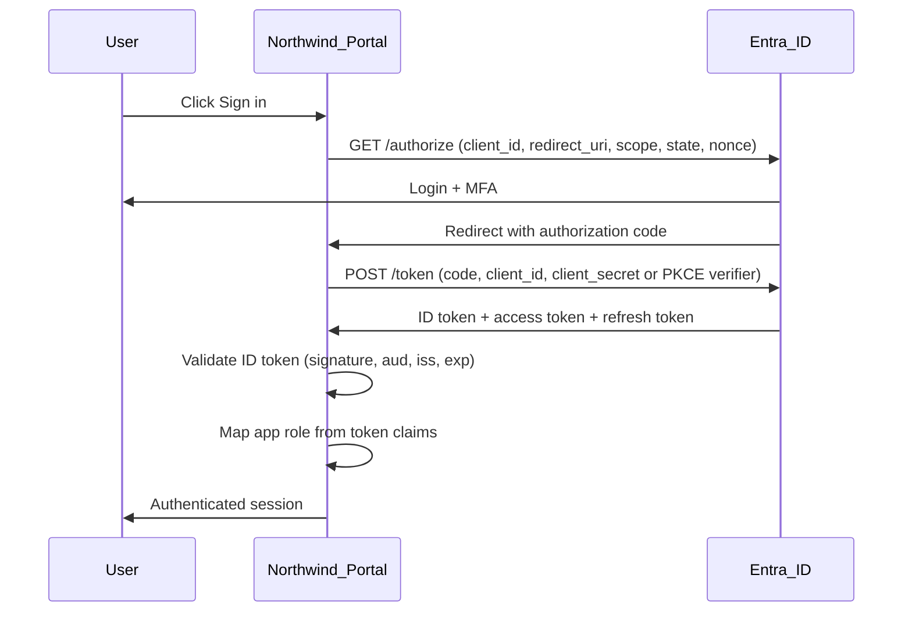

# OIDC Token Flow — Northwind Employee Portal

Authorization code flow with PKCE (recommended for SPAs) or confidential client flow for the Northwind Portal integration.

## Sequence Diagram



## Tokens Issued

| Token | Purpose | Key Claims |
|-------|---------|------------|
| ID token | Authentication — who the user is | `sub`, `name`, `email`, `groups`, `roles` |
| Access token | Authorization — API access | `scp`, `roles`, `aud` |
| Refresh token | Silent re-authentication | — |

## Scopes Requested

```
openid profile email api://northwind-portal/access
```

## Endpoints (Entra ID v2)

| Endpoint | URL pattern |
|----------|-------------|
| Authorization | `https://login.microsoftonline.com/{tenant}/oauth2/v2.0/authorize` |
| Token | `https://login.microsoftonline.com/{tenant}/oauth2/v2.0/token` |
| JWKS | `https://login.microsoftonline.com/{tenant}/discovery/v2.0/keys` |

Replace `{tenant}` with your tenant ID or domain.

## Verification

- IT admin receives `Portal.Admin` in `roles` claim
- Standard employee receives `Portal.User` in `roles` claim
- ID token `aud` matches Portal client ID
- Access token includes requested API scope

Spec reference: [oidc-portal.spec.json](../../../automation/config/oidc-portal.spec.json)
