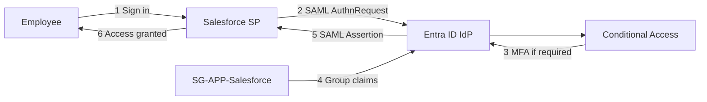

# SAML Federation Architecture

Enterprise SAML 2.0 single sign-on from **Microsoft Entra ID** (Identity Provider) to **Salesforce** (Service Provider) for Northwind Collaborative.

## System Context

## Components

| Component | Role |
|-----------|------|
| Microsoft Entra ID | Identity Provider — authenticates users, issues SAML assertions |
| Salesforce CRM (gallery app) | Service Provider — validates assertions, grants application access |
| `SG-APP-Salesforce` | Security group controlling CRM entitlement (Finance, Operations) |
| Conditional Access / Security defaults | MFA and sign-in protection |

## Onboarding Model

Salesforce CRM is added from the **Entra application gallery** (gallery search: **Salesforce**). The `SG-APP-Salesforce` group controls CRM entitlement for Finance and Operations; SAML protocol configuration happens on the gallery enterprise application.

OIDC/OAuth is a separate integration on **Northwind Employee Portal**. See [OIDC architecture](../oidc/architecture.md) and [application onboarding runbook](../../application-onboarding/runbook.md).

## Configuration Spec

Lab configuration: [saml-salesforce.spec.json](../../../automation/config/saml-salesforce.spec.json)

Validation: `Verify-LabFederation.ps1 -Protocol SAML`

## Entra ID Free Considerations

- Group assignment to enterprise applications requires P1+ in the portal
- Use **Security groups** group claim filtered to `SG-APP-Salesforce`
- Assign pilot users individually for SSO testing

Further reading: [claims mapping](./claims-mapping.md), [login flow](./login-flow.md).
