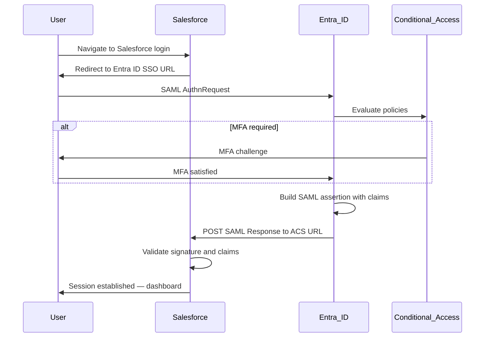

# SAML Login Flow — Salesforce CRM

Step-by-step SSO flow for Northwind Collaborative employees accessing Salesforce via Entra ID (gallery enterprise application).

## Sequence Diagram

## Flow Steps

1. User navigates to Salesforce login page
2. Salesforce redirects to Entra ID SSO URL with SAML AuthnRequest
3. Entra ID authenticates user (password + MFA if required)
4. Entra ID evaluates Conditional Access policies or Security defaults
5. Entra ID generates SAML assertion with user attributes and group claims
6. Browser POSTs assertion to Salesforce ACS URL
7. Salesforce validates signature, NameID, and claims
8. User receives Salesforce session

## Prerequisites

- User is member of `SG-APP-Salesforce`
- User assigned to Salesforce enterprise app (required on Entra Free — assign pilot users individually)
- Gallery **Salesforce CRM** enterprise app configured for SAML in Entra ID
- MFA registered (Security defaults or CA policy)

## Troubleshooting

| Symptom | Likely Cause | Action |
|---------|--------------|--------|
| SSO redirect loop | ACS URL mismatch | Verify Reply URL in Entra matches Salesforce SSO settings |
| Access denied | User not in `SG-APP-Salesforce` | Add user to group; wait for sync |
| Invalid NameID | Wrong claim format | Set NameID to UPN with emailAddress format |
| MFA not prompted | CA not scoped to app | Verify CA-002 includes Salesforce enterprise app |
| App not in portal filter | Application type filter | Search **All applications** for `Salesforce CRM` |

## Lab Simulation

Without a Salesforce Developer Edition org, verify Entra-side configuration and capture sign-in log entries showing successful SAML authentication to the gallery enterprise application.

Validate with `Verify-LabFederation.ps1 -Protocol SAML`. Portfolio evidence: live SAML config screenshots in `docs/screenshots/` plus `saml-login-flow.png` for sign-in flow when a Salesforce org is unavailable.
