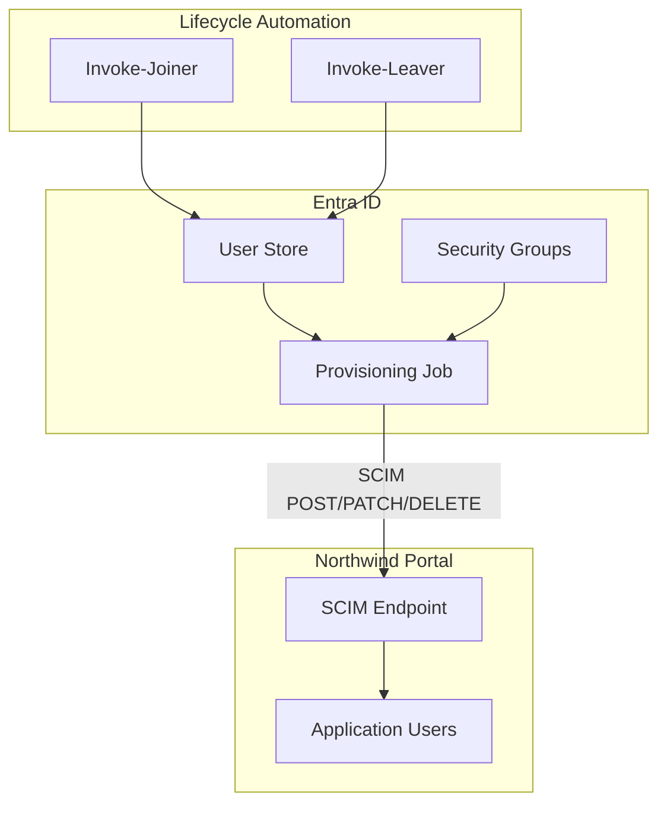

# SCIM Provisioning Architecture

Automated user and group provisioning from **Microsoft Entra ID** to the **Northwind Employee Portal** via SCIM 2.0.

## System Context



## Provisioning Flow

### Create (Joiner)

```text
New user created in Entra (Invoke-Joiner or manual)
        ↓
Assigned to SG-DEPT-*, SG-ROLE-*, SG-APP-NorthwindPortal
        ↓
Entra provisioning job detects new assignment scope
        ↓
SCIM POST /Users → account created in Portal
```

### Update (Mover)

```text
User department/title/manager updated (Invoke-Mover)
        ↓
SCIM PATCH /Users/{id} → attributes updated in Portal
```

### Deprovision (Leaver)

```text
User disabled in Entra (Invoke-Leaver)
        ↓
SCIM PATCH /Users/{id} active=false OR DELETE
        ↓
Access removed in Portal
```

## Configuration

Attribute mapping spec: [scim-portal.mapping.json](../../../automation/config/scim-portal.mapping.json)

JML automation that drives provisioning events: [JML runbook](../../jml/joiner-mover-leaver.md).
