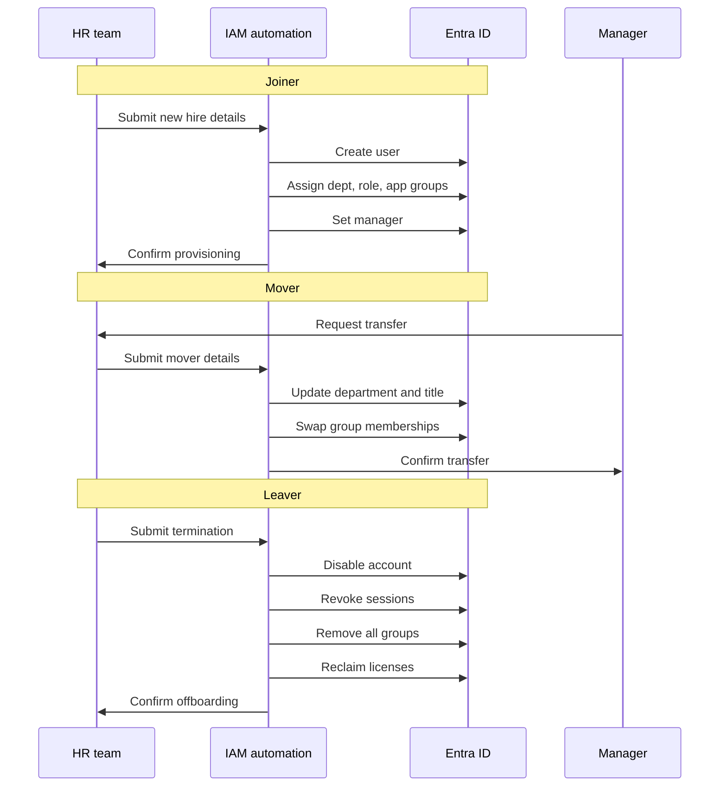

# Joiner / Mover / Leaver Runbook

Identity lifecycle automation for Northwind Collaborative using Microsoft Graph and PowerShell.

## Process Overview

```mermaid
flowchart TB
  subgraph joiner [Joiner]
    J1[HR ticket approved]
    J2[Invoke-Joiner.ps1]
    J3[User created]
    J4[Groups assigned]
    J5[License via group]
    J1 --> J2 --> J3 --> J4 --> J5
  end

  subgraph mover [Mover]
    M1[Transfer approved]
    M2[Invoke-Mover.ps1]
    M3[Profile updated]
    M4[Groups swapped]
    M1 --> M2 --> M3 --> M4
  end

  subgraph leaver [Leaver]
    L1[Termination approved]
    L2[Invoke-Leaver.ps1]
    L3[Account disabled]
    L4[Sessions revoked]
    L5[Groups removed]
    L6[License reclaimed]
    L1 --> L2 --> L3 --> L4 --> L5 --> L6
  end
```



## Swimlane



## Joiner

**Trigger:** HR approved new hire ticket.

**Script:** `automation/scripts/Invoke-Joiner.ps1`

**Steps automated:**
1. Create Entra user with department, title, UPN
2. Set manager reference
3. Assign department group (`SG-DEPT-*`)
4. Assign role group (`SG-ROLE-*`)
5. Assign default app groups (M365, Portal)
6. Assign Salesforce group if Finance/Operations
7. Assign license group (`SG-LIC-M365-E3`)

**Example:**
```powershell
.\Invoke-Joiner.ps1 `
  -UserPrincipalName 'alex.newton@northwindcollab.onmicrosoft.com' `
  -DisplayName 'Alex Newton' `
  -GivenName 'Alex' -Surname 'Newton' `
  -Department 'Engineering' `
  -JobTitle 'Software Engineer' `
  -RoleTier 'Employee' `
  -ManagerUpn 'brian.carol@northwindcollab.onmicrosoft.com' `
  -Password 'ChangeMe!2026Lab'
```

**Manual follow-up:** MFA registration within 7 days (enforced by CA-002).

## Mover

**Trigger:** Department or role change approved by HR and receiving manager.

**Script:** `automation/scripts/Invoke-Mover.ps1`

**Steps automated:**
1. Update `department` and `jobTitle` attributes
2. Update manager if provided
3. Remove old department group membership
4. Remove stale role group memberships
5. Remove Salesforce group if leaving Finance/Operations
6. Add new department, role, and app groups

**Example:**
```powershell
.\Invoke-Mover.ps1 `
  -UserPrincipalName 'james.anderson@northwindcollab.onmicrosoft.com' `
  -NewDepartment 'IT' `
  -NewJobTitle 'IT Project Coordinator' `
  -NewRoleTier 'Employee' `
  -NewManagerUpn 'kevin.donna@northwindcollab.onmicrosoft.com'
```

## Leaver

**Trigger:** HR termination ticket with effective date.

**Script:** `automation/scripts/Invoke-Leaver.ps1`

**Steps automated:**
1. Disable account (`accountEnabled = false`)
2. Revoke all refresh tokens / sessions
3. Remove from all security groups
4. Optional: reclaim licenses with `-RemoveLicenses`

**Example:**
```powershell
.\Invoke-Leaver.ps1 `
  -UserPrincipalName 'james.anderson@northwindcollab.onmicrosoft.com' `
  -RemoveLicenses
```

**Safeguard:** Script refuses to offboard `adm-breakglass`.

## SLA Targets (Lab Documentation)

| Event | Target completion |
|-------|-------------------|
| Joiner | Same business day |
| Mover | Within 24 hours of effective date |
| Leaver | Within 1 hour of effective time |

## Error Handling

| Code | Meaning | Action |
|------|---------|--------|
| ALREADY_EXISTS | Joiner user present | Verify attributes; update manually if needed |
| Group not found | Missing SG-* group | Run `Import-LabGroups.ps1` |
| Manager not found | Invalid manager UPN | Fix HR source data |

## Evidence

Retain script output logs and HR ticket references (lab journal). Export group membership before/after for access reviews.
